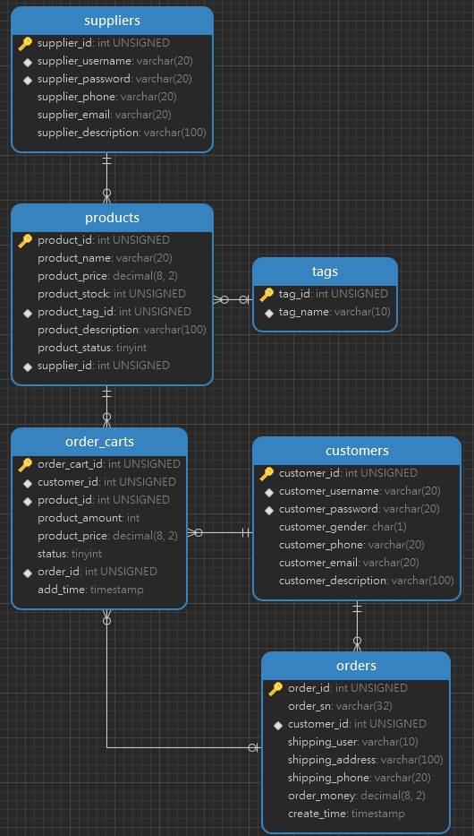

<h1 align="center">商城系统</h1>

使用ssm+vue框架实现的商城用户端系统

## 商城系统的表结构

表结构的图像如下所示：

## 表模型及业务详解

项目包含业务如下：

* 商城用户注册登录
* 用户可以浏览商品，或模糊索引商品中的相关参数
* 用户可以将选中的商品添加放入购物车
* 用户可以在购物车中选择支付创建订单，生成订单并清空购物车

### 用户登录，注册

`customers`

| 列名                     | 数据类型     | 附加属性                              | 备注                                     |
| ------------------------ | ------------ | ------------------------------------- | ---------------------------------------- |
| customer_id(PK)          | INT UNSIGNED | PRIMARY KEY, NOT NULL, AUTO_INCREMENT | 用户id，自动生成                         |
| customer_username(INDEX) | VARCHAR(20)  | index_username_password               | 登录用户名（8-16位），不能为空，前端校验 |
| customer_password(INDEX) | VARCHAR(20)  | index_username_password               | 登录密码（8-16位），不能为空，前端校验   |
| customer_gender          | CHAR(1)      |                                       | '1'为男，‘0’为女，默认为'1'              |
| customer_phone           | VARCHAR(20)  |                                       | 定长11位，前端校验                       |
| customer_email           | VARCHAR(20)  |                                       | 无                                       |
| customer_description     | VARCHAR(100) |                                       | 无                                       |

### 业务

`suppliers`

| 列名                     | 数据类型     | 附加属性                              | 备注                                     |
| ------------------------ | ------------ | ------------------------------------- | ---------------------------------------- |
| supplier_id(PK)          | INT UNSIGNED | PRIMARY KEY, NOT NULL, AUTO_INCREMENT | 供应商id，自动生成                       |
| supplier_username(INDEX) | VARCHAR(20)  |                                       | 登录用户名（8-16位），不能为空，前端校验 |
| supplier_password        | VARCHAR(20)  |                                       | 登录密码（8-16位），不能为空，前端校验   |
| supplier_phone           | VARCHAR(20)  |                                       | 定长11位，前端校验                       |
| supplier_email           | VARCHAR(20)  |                                       | 无                                       |
| supplier_description     | VARCHAR(100) |                                       | 无                                       |

`products`

| 列名                  | 数据类型     | 附加属性                                        | 备注                            |
| --------------------- | ------------ | ----------------------------------------------- | ------------------------------- |
| product_id(PK)        | INT UNSIGNED | PRIMARY KEY, NOT NULL, AUTO_INCREMENT           | 商品id，自动生成                |
| product_name          | VARCHAR(20)  |                                                 | 商品名称                        |
| product_price         | DECIMAL(8,2) |                                                 | 商品价格                        |
| product_stock         | INT UNSIGNED |                                                 | 商品库存数量                    |
| product_tag_id(FK)    | INT          | FOREIGN KEY fk_products_tags(product_tag_id)    | 商品分类，外键，引用            |
| product_description   | VARCHAR(100) |                                                 | 商品描述                        |
| product_status        | TINYINT      | DEFAULT 0                                       | 上下架状态：0下架，1上架        |
| supplier_id(FK)       | INT UNSIGNED | FOREIGN KEY fk_products_suppliers(supplier_id)  | 外键，引用suppliers.supplier_id |

`tags`

| 列名      | 数据类型     | 附加属性                              | 备注                                  |
| --------- | ------------ | ------------------------------------- | ------------------------------------- |
| tag_id    | INT UNSIGNED | PRIMARY KEY, NOT NULL, AUTO_INCREMENT | 分类表ID，自动生成                    |
| tag_name  | VARCHAR(10)  |                                       | 类别名称（在product表中作为外键约束） |

`order_carts`

| 列名              | 数据类型     | 附加属性                              | 备注           |
| ----------------- | ------------ | ------------------------------------- | -------------- |
| order_cart_id(PK) | INT UNSIGNED | PRIMARY KEY, NOT NULL, AUTO_INCREMENT | 购物车ID       |
| order_id          | INT UNSIGNED | FOREIGN KEY                           | 订单的单号   |
| customer_id       | INT UNSIGNED |                                       | 用户ID         |
| product_id        | INT UNSIGNED |                                       | 商品ID         |
| product_amount    | INT          |                                       | 加入购物车数量 |
| product_price     | DECIMAL(8,2) |                                       | 商品价格       |
| add_time          | TIMESTAMP    |                                       | 加入购物车时间 |

`orders`

| 列名             | 数据类型     | 附加属性                              | 备注                                             |
| ---------------- | ------------ | ------------------------------------- | ------------------------------------------------ |
| order_id(PK)     | INT UNSIGNED | PRIMARY KEY, NOT NULL, AUTO_INCREMENT | 订单ID                                           |
| order_sn         | VARCHAR(20)  |                                       | 订单编号（年+月+日+order_id） yyyymmddnnnnnnnnnn |
| customer_id      | INT UNSIGNED |                                       | 下单用户ID                                       |
| shipping_user    | VARCHAR(10)  |                                       | 收货人姓名                                       |
| shipping_address | VARCHAR(100) |                                       | 收货人地址                                       |
| shipping_phone   | VARCHAR(20)  |                                       | 收货人联系方式                                   |
| order_money      | DECIMAL(8,2) |                                       | 订单金额                                         |
| create_time      | TIMESTAMP    |                                       | 下单时间                                         |